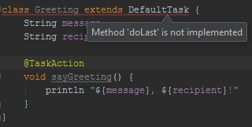
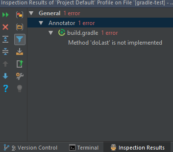

# as3-gradle-test
Test project to show error in the AS Annotator inspection.  
The error will show up when you add a `buildSrc` directory

* import the project in `Android Studio 3.0.1`
* execute "Refresh all Gradle projects"
* now open the [build.gradle](build.gradle) file and Android Studio will show this error:  

When you execute *Analyze* - *Inspect* code on the file you will see that the error is reported by the Annotator:

Notes:
* when you import the same project in `IntelliJ 2017.2.5` it shows no error
* [StackOverflow Question: buildSrc dir + CustomTask: Method 'doLast` is not implemented](https://stackoverflow.com/questions/47532977/buildsrc-dir-customtask-method-dolast-is-not-implemented)
* [Android Studio Issue#70015222](https://issuetracker.google.com/issues/70015222)
